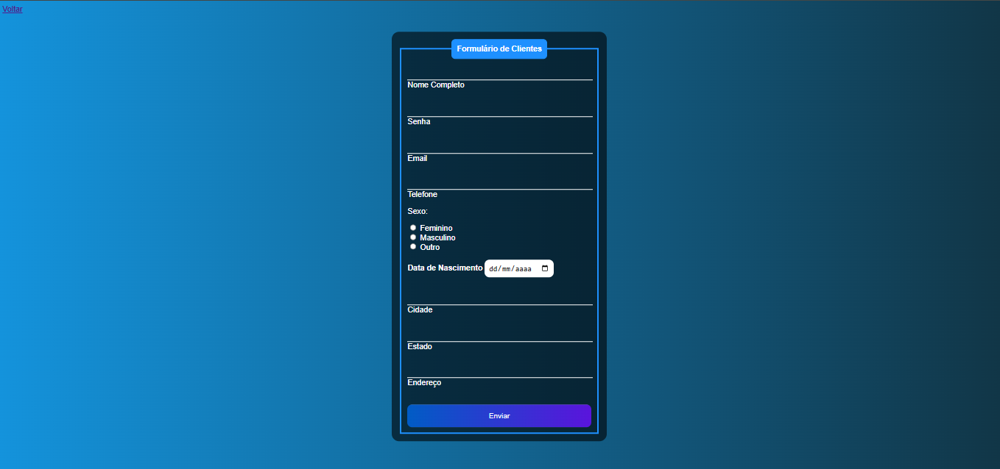

# Sistema de Login, Cadastro e Consulta de dados.
Este projeto é um sistema simples de login, cadastro e gerenciamento de usuários, desenvolvido com PHP, MySQL e Bootstrap.

## 🔍 Funcionalidades
- Cadastro de usuários
- Login com verificação de credenciais
- Listagem de registros
- Edição e exclusão de dados

## 🛠️ Tecnologias utilizadas
- PHP
- MySQL
- Bootstrap 5
- XAMPP (ambiente local)

## 📎 Como executar
1. Coloque o projeto na pasta `htdocs` do XAMPP.
2. Crie um banco de dados chamado `formulario-lucas`.
3. Altere os dados de conexão em `config.php`.
4. Acesse `localhost/formulario-login` no navegador.

## 👨‍💻 Autor
Lucas Gabriel Lopes Costa — 16 anos, estudante de Desenvolvimento de Sistemas na Etec de Itaquera.

